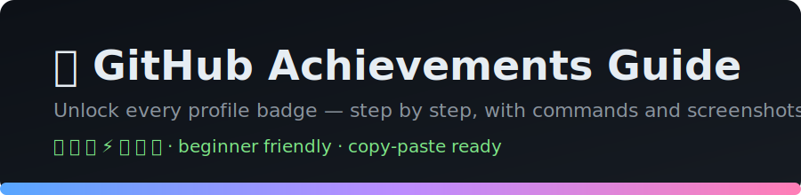

<p align="center">
  
</p>

<h1 align="center">🏆 GitHub Achievements Guide</h1>

<p align="center">
  <b>A step-by-step guide to unlocking every badge on your GitHub profile.</b><br/>
  Beginner friendly · copy-paste commands · real badge art from GitHub.
</p>

<p align="center">
  
  
  
  
</p>

---

## 🚀 Start Here — Earn Your FIRST Badge in 10 Seconds

New to this? Get the **Quickdraw ⚡** badge right now, using this repo:

> **[👉 Open an issue and close it within 5 minutes](https://github.com/JaydeepGadhiya/github-badges-achievements/issues/new/choose)** — that's it!
> Full walkthrough: **[Get Your First Achievement](guides/first-achievement.md)** ⚡

```
  New issue  ──▶  Submit  ──▶  Close issue   (⏱️ under 5:00)
     🐞            📝            ✅  =  ⚡ Quickdraw!
```

---

## 📖 What are GitHub Achievements?

Achievements are little badges that appear in a **"Achievements"** panel in the sidebar of your GitHub profile. They're purely cosmetic flair — a fun way to show your activity. Many have **tiers** (Default → 🥉 Bronze → 🥈 Silver → 🥇 Gold) shown as a small number or star on the badge.

> 👀 **Don't see the panel?** Go to **Settings → Public profile → Achievements** and tick *"Show Achievements on my profile."*

---

## 🎖️ The Badges

| Badge | Name | What it takes | Difficulty | ⏱️ Time |
|:---:|:---|:---|:---:|:---:|
|  | **Pull Shark** | Get pull requests merged | 🟢 Easy | ~5 min |
|  | **Quickdraw** | Close an issue/PR within 5 minutes | 🟢 Easy | ~2 min |
|  | **Pair Extraordinaire** | Co-author a commit in a merged PR | 🟢 Easy | ~10 min |
|  | **YOLO** | Merge a PR without a review | 🟢 Easy | ~3 min |
|  | **Galaxy Brain** | Get answers accepted in Discussions | 🟡 Medium | ~15 min |
|  | **Public Sponsor** | Sponsor a developer publicly | 🟡 Medium | ~5 min ($) |
|  | **Starstruck** | Create a repo that earns 16+ stars | 🔴 Hard | days–weeks |

📂 **Full step-by-step guide for each badge → the [`guides/`](guides/README.md) folder.**

- ⚡ [**Get Your First Achievement** (start here!)](guides/first-achievement.md)
- 🦈 [Pull Shark](guides/pull-shark.md)
- ⚡ [Quickdraw](guides/quickdraw.md)
- 👯 [Pair Extraordinaire](guides/pair-extraordinaire.md)
- 🎲 [YOLO](guides/yolo.md)
- 🧠 [Galaxy Brain](guides/galaxy-brain.md)
- 💖 [Public Sponsor](guides/public-sponsor.md)
- 🌟 [Starstruck](guides/starstruck.md)

---

## 🥇 Badge Tiers

Most badges level up as you do more. Here are the thresholds:

| Badge | 🥉 Bronze | 🥈 Silver | 🥇 Gold | 💠 Highest |
|:---|:---:|:---:|:---:|:---:|
| 🦈 Pull Shark | 16 | 128 | 1024 | — |
| 🧠 Galaxy Brain | 8 | 16 | 32 | — |
| 👯 Pair Extraordinaire | 10 | 24 | 48 | — |
| 🌟 Starstruck | 128 | 512 | 4096 | — |

> ⚡ Quickdraw, 🎲 YOLO and 💖 Public Sponsor are **single-tier** — you either have them or you don't.

---

## 🕹️ 15-Minute Speedrun (unlock 4 badges fast)

Want a quick win? Do these on **your own test repo** — all four are legit and safe:

1. **Create a repo** (e.g. `achievements-playground`) with a README. 📦
2. **⚡ Quickdraw** → open an Issue, then close it within 5 minutes.
3. **🦈 Pull Shark + 🎲 YOLO** → create a branch, edit a file, open a PR, and **merge it yourself** (no reviewer). Do it twice for Pull Shark.
4. **👯 Pair Extraordinaire** → add a `Co-authored-by:` line to a commit, open a PR, merge it.

⏳ Badges can take a few minutes to a few hours to appear — be patient!

---

## 🚫 Retired Badges (no longer earnable)

| Badge | Was awarded for |
|:---|:---|
| ❄️ **Arctic Code Vault Contributor** | Code archived in the 2020 Arctic Code Vault |
| 🚁 **Mars 2020 Helicopter Contributor** | Contributed to repos used by NASA's Ingenuity helicopter |

If you already have these, they stay on your profile forever. 🎉

---

## ❓ FAQ

<details>
<summary><b>Do private repos count?</b></summary>

Yes for **Pull Shark** and **Pair Extraordinaire**, as long as your settings share private contributions. Stars (Starstruck) and Discussions (Galaxy Brain) need public repos.
</details>

<details>
<summary><b>How long until a badge shows up?</b></summary>

Usually minutes, sometimes a few hours. Refresh your profile later if it's not instant.
</details>

<details>
<summary><b>Is "farming" badges against the rules?</b></summary>

The self-merge / quick-close tricks are widely used and **allowed** — they're just profile flair. But **Starstruck** and real open-source Pull Shark contributions are what actually impress recruiters. Earn, don't just farm. 💪
</details>

<details>
<summary><b>Can I hide my achievements?</b></summary>

Yes — **Settings → Public profile → Achievements → untick "Show Achievements on my profile."**
</details>

---

## 🤝 Contributing

Found a new badge, updated threshold, or a better trick? PRs welcome — see [CONTRIBUTING.md](CONTRIBUTING.md). ⭐ Star this repo if it helped!

## 📝 License

[MIT](LICENSE) — free to use, share, and remix.

<sub>Badge images © GitHub, used from GitHub's public profile assets. This is an unofficial community guide and is not affiliated with GitHub, Inc.</sub>
